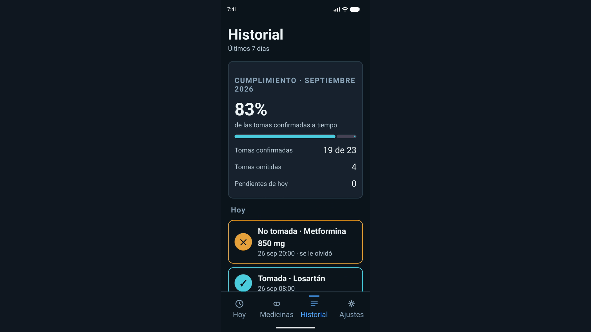
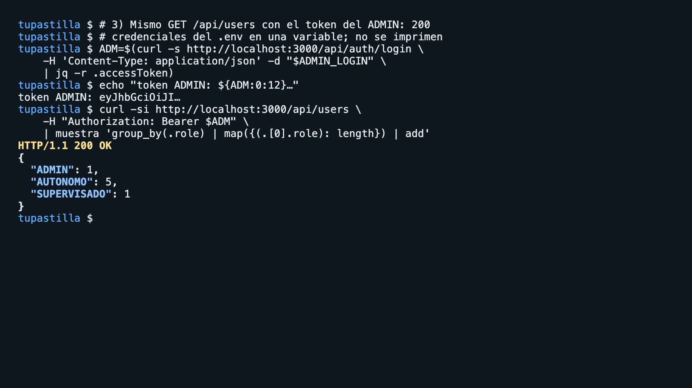
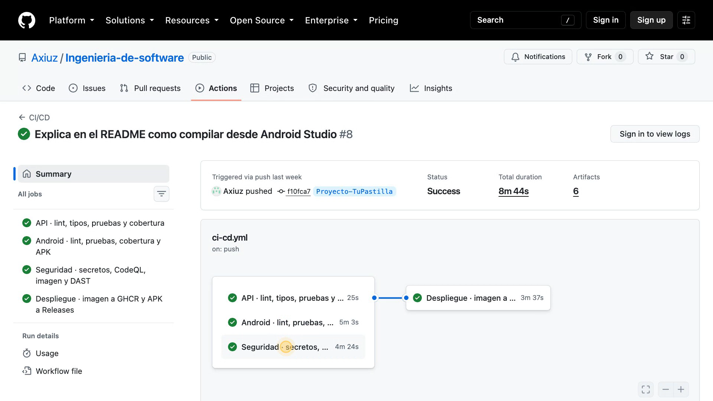
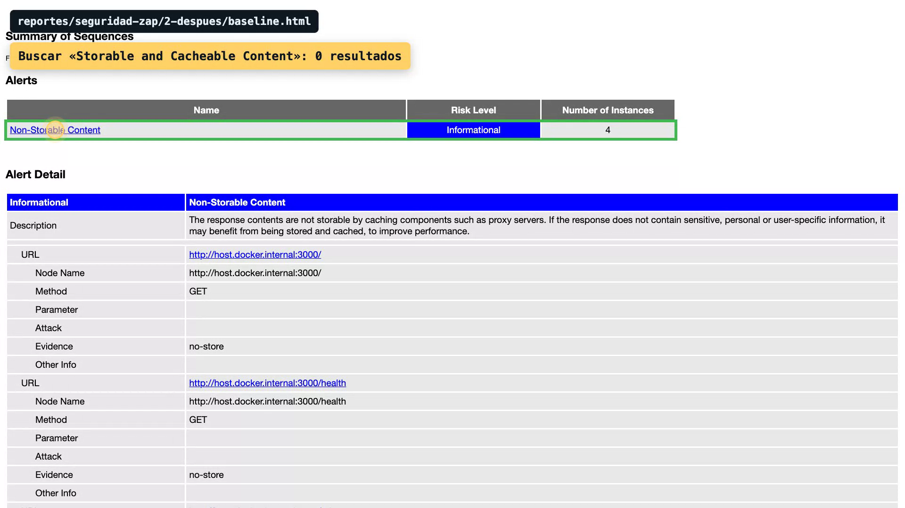

# TuPastilla

App Android de seguimiento de medicamentos. Avisa a la hora exacta de cada toma,
registra lo que se tomó y lo que no, y lleva la cuenta de las pastillas que quedan
en la caja.

Está construida a partir del prototipo de diseño **TuPastilla · Paciente autónomo** y
de su especificación de implementación (proyecto de diseño `4825c2b6`).

## Guía rápida para revisar la entrega

| Quiero... | Ir a |
|---|---|
| Ver la app funcionando sin instalar nada | [Demos en video](#demos-en-video) |
| Instalar y correr la app en mi computadora | [Instalar desde cero con Android Studio](#instalar-desde-cero-con-android-studio) |
| Ver el pipeline, el APK publicado y las evidencias | [Entrega final](#entrega-final) |
| Saber qué hizo cada integrante | [Integrantes y reparto del trabajo](#integrantes-y-reparto-del-trabajo) |
| Revisar la rúbrica punto por punto | [`docs/rubrica.md`](docs/rubrica.md) |

## Demos en video

Haz clic en cada imagen para abrir el video.

| | |
|---|---|
| **1. La app**: pestañas Hoy, Medicinas, Historial y Ajustes con datos de prueba.<br>[](demos/demo-01-app.mp4) | **2. Autenticación y roles**: login contra la API y acceso por rol con token.<br>[](demos/demo-02-auth.mp4) |
| **3. CI/CD**: los cuatro jobs del pipeline en verde y el despliegue.<br>[](demos/demo-03-cicd-16x9.mp4) | **4. Seguridad**: reportes de ZAP antes y después de las correcciones.<br>[](demos/demo-04-seguridad-16x9.mp4) |

## Instalar desde cero con Android Studio

Tiempo aproximado: 20 minutos la primera vez (la mayor parte es la descarga de Gradle y del SDK).

### Qué hay que tener instalado

- [Android Studio](https://developer.android.com/studio) (trae su propio JDK y el emulador).
- [Docker Desktop](https://www.docker.com/products/docker-desktop/) abierto (levanta la base de datos y la API).
- Git.

### Pasos

1. **Clonar el repositorio en la rama del proyecto.** En una terminal:
   ```bash
   git clone -b Proyecto-TuPastilla https://github.com/Axiuz/Ingenieria-de-software.git
   cd Ingenieria-de-software
   ```
2. **Crear el archivo `.env` de la API.** Genera contraseñas aleatorias; no hay que editar nada:
   ```bash
   cat > .env <<EOF
   MYSQL_PASSWORD=$(openssl rand -hex 16)
   MYSQL_ROOT_PASSWORD=$(openssl rand -hex 16)
   JWT_SECRET=$(openssl rand -base64 48)
   CORS_ORIGINS=
   TRUST_PROXY=false
   API_IMAGE=ghcr.io/axiuz/tupastilla-api:latest
   EOF
   ```
   En Windows se ejecuta desde Git Bash.
3. **Levantar la API.** Con Docker Desktop abierto:
   ```bash
   docker compose up -d
   ```
   Descarga la imagen publicada por el pipeline, crea la base MySQL y aplica las migraciones. Para comprobar que responde, abrir http://localhost:3000/health: debe mostrar `{"status":"ok"}`.
4. **Abrir el proyecto en Android Studio.** **File > Open** y elegir la carpeta `Ingenieria-de-software` (la que contiene `settings.gradle.kts`). Esperar a que termine el **Gradle Sync**: la primera vez tarda entre 3 y 10 minutos. Si pide instalar SDK 37 o build-tools, aceptar.
5. **Crear un emulador** si no hay uno: **Tools > Device Manager > Create Device**, elegir un Pixel y una imagen de sistema reciente.
6. **Correr la app.** Elegir el emulador en la barra superior, junto a la configuración `app`, y pulsar **Run** (triángulo verde). Se instala la versión debug, que apunta sola a la API del paso 3.
7. **Usar la app.** Crear una cuenta desde la pantalla de registro. Para llenarla sin capturar nada: **Ajustes > Cargar datos de prueba**. Para ver el aviso de toma sin esperar a su hora: **Ajustes > Ver cómo se ve el aviso del sistema**.

Para detenerlo todo al terminar: `docker compose down`.

### Si algo falla

| Síntoma | Causa y solución |
|---|---|
| `docker compose` dice `define MYSQL_PASSWORD en .env` | Falta el paso 2 o se ejecutó en otra carpeta. Repetirlo en la raíz del repositorio. |
| La app abre pero no deja iniciar sesión | La API no está arriba. Revisar http://localhost:3000/health y `docker compose ps`. |
| Se usa un teléfono real en vez del emulador | Ver [Con teléfono por USB](#con-teléfono-por-usb). |
| Prefiero no compilar | Instalar el APK ya compilado del [release build-4](https://github.com/Axiuz/Ingenieria-de-software/releases/tag/build-4) arrastrándolo al emulador. Necesita la API del paso 3. |

## Entrega final

- Código: rama `Proyecto-TuPastilla` de https://github.com/Axiuz/Ingenieria-de-software
- Pipeline en verde: [ejecución 35495568857](https://github.com/Axiuz/Ingenieria-de-software/actions/runs/35495568857)
- APK publicado: [release build-4](https://github.com/Axiuz/Ingenieria-de-software/releases/tag/build-4)
- Imagen de la API: `ghcr.io/axiuz/tupastilla-api:latest`
- Evidencias (capturas de pipeline, SonarQube, despliegue y APK en el emulador): carpeta `evidencias/`
- Cumplimiento de la rúbrica punto por punto: `docs/rubrica.md`
- Reparto del trabajo por integrante: sección [Integrantes y reparto del trabajo](#integrantes-y-reparto-del-trabajo)

## Integrantes y reparto del trabajo

| Integrante | Parte |
|---|---|
| Luis Yael Camberos | 1. Base de la app Android |
| Michel García González | 2. Lógica de la app |
| Saúl Hernández Torres | 3. Backend y 4. Infraestructura y CI/CD |
| Juan Marco García Navarro | 4. Infraestructura y CI/CD |
| Dalia Alejandra Andrade Martínez | 5. Calidad y seguridad |
| Daniela Lizeth Prudencio Real | 6. Documentación y evidencias |

### 1. Base de la app Android (Yael)
Pasa el repositorio de Maven a Gradle y deja lista la estructura de la app: dependencias, R8 en release, cobertura con JaCoCo y los layouts, textos y temas de todas las pantallas.
- `2d0cff1` Elimina el proyecto Maven de la actividad de calidad anterior
- `f57fadf` Agrega el proyecto Gradle de Android como base del nuevo sistema
- `2c4afc0` Configura dependencias, R8 en release y cobertura con JaCoCo
- `58f867c` Integra layouts, strings y temas para todas las pantallas

### 2. Lógica de la app (Michel)
Base de datos local con Room, navegación por pestañas, avisos de toma y la conexión con la API para iniciar sesión, con la sesión guardada cifrada.
- `e2a96e9` Implementa la base de la app: Room, pestañas, avisos y personas
- `ccbd2a4` Agrega login y registro contra la API con sesión cifrada y refresh
- `9acb5f2` Agrega tests unitarios para la app y el módulo de autenticación

### 3. Backend (Saúl)
API en Express con Prisma y MySQL: registro, login, renovación de token, cierre de sesión y roles, con pruebas unitarias y de ataque.
- `3fbd57c` Inicia el backend con Express, Prisma y MySQL
- `ad9909d` Implementa registro, login, refresh, logout y roles en la API
- `ef357d9` Agrega 82 tests unitarios y de ataque para la API
- `033f286` Agrega middleware para evitar almacenamiento en caché de respuestas

### 4. Infraestructura y CI/CD (Saúl y Juan Marco)
Contenedores para producción y desarrollo, arranque local con un comando y el pipeline que prueba, analiza y despliega la API y el APK.
- `f066098` Configura contenedores de producción, desarrollo y arranque local
- `3dfea8a` Agrega pipeline de CI/CD con pruebas, auditoría y escaneo ZAP
- `8180fe0` Corrige versiones de actions que rompían el pipeline
- `7c1d4f9` Configura el despliegue en Proyecto-TuPastilla y activa escaneo de ZAP
- `7c1910d` Fija la imagen de la API a linux/amd64 para Apple Silicon

### 5. Calidad y seguridad (Dalia)
Corrección de los hallazgos de SonarQube, bloqueo del tráfico sin cifrar y los informes de calidad, seguridad, cierre y plan de mejora.
- `9ab669e` Corrige hallazgos de SonarQube y prohíbe el tráfico en claro
- `31d97d2` Excluye los ids de hallazgos de Sonar del escaneo de gitleaks
- `86ac002` Agrega informes, plan de mejora y guía técnica del proyecto
- `9398390` Crea documentación de calidad, seguridad y seguimiento del proyecto

### 6. Documentación y evidencias (Daniela)
README, scripts de entrega, verificación del entorno desplegado y capturas que prueban el pipeline, SonarQube y el APK publicado.
- `0bdfda6` Actualiza el README e ignora docs/demo y artefactos de build
- `2f3e564` Agrega documentación completa y scripts de entrega automatizada
- `cf5b910` Documenta la verificación del entorno de prueba desplegado
- `71f5738` Agrega la captura del APK publicado corriendo en el emulador
- `58d9325` Agrega las capturas del pipeline y del tablero de SonarQube
- `1ef12f6` Agrega la captura del release con el APK publicado
- `f10fca7` Explica en el README cómo compilar desde Android Studio

---

# Detalle técnico

## Requisitos
- JDK 21, Android SDK (compileSdk 37, minSdk 24), Android Studio o el emulador de la línea de comandos.
- Node 24 o superior y pnpm 11.17.0 (viene fijado en packageManager).
- Docker Desktop (MySQL 8.4, escaneos de seguridad y SonarQube).

## Instalar dependencias
- API: `cd tupastilla-api && pnpm install --frozen-lockfile`
- App: no requiere instalar nada, Gradle descarga todo con `./gradlew`.

## Variables de entorno
- La API se configura con `tupastilla-api/.env`; se copia de `tupastilla-api/.env.example`. La API no arranca si falta algo o si JWT_SECRET tiene menos de 32 caracteres.
- Variables: NODE_ENV, PORT (3000), DATABASE_URL (mysql://...), JWT_SECRET (obligatorio, mínimo 32 caracteres, generar con `openssl rand -base64 48`), JWT_ISSUER, JWT_AUDIENCE, ACCESS_TOKEN_TTL_SECONDS (900), REFRESH_TOKEN_TTL_DAYS (7), CORS_ORIGINS, TRUST_PROXY, ADMIN_EMAIL y ADMIN_PASSWORD (crean el administrador en la semilla).
- Para producción con docker compose se usa `.env` en la raíz, copiado de `.env.example`: MYSQL_PASSWORD, MYSQL_ROOT_PASSWORD, JWT_SECRET, CORS_ORIGINS, TRUST_PROXY, ADMIN_EMAIL, ADMIN_PASSWORD, API_IMAGE.
- Ningún secreto se escribe en el código ni se sube al repositorio: los archivos .env están en .gitignore y en el pipeline los valores vienen de los secretos de GitHub.

## Ejecutar en local
- Todo de una vez: `bash Scripts/start.sh` (levanta MySQL en Docker, crea el .env con un JWT_SECRET aleatorio si no existe, migra, siembra y arranca la API en http://localhost:3000).
- Solo la API con la pila completa en contenedores: `docker compose up -d`.
- App en el emulador: `./gradlew :app:installDebug`. En debug la app apunta a http://10.0.2.2:3000 (la API del equipo anfitrión).

## Compilar desde Android Studio (detalle)

1. Abrir Android Studio, ir a **File > Open** y elegir la carpeta raíz del repositorio (la que contiene `settings.gradle.kts`).
2. Esperar el **Gradle Sync**. La primera vez descarga Gradle 9.5 y el JDK 25: tarda entre 3 y 10 minutos. Si aparece un aviso para instalar SDK 37 o build-tools, aceptarlo.
3. Levantar la API antes de correr la app: en una terminal en la raíz del repositorio, ejecutar `docker compose up -d`. Sin la API, la app abre pero no permite iniciar sesión.
4. Elegir el dispositivo en la barra superior, junto a la configuración `app`: un emulador o un teléfono conectado por USB con depuración activada.
5. Pulsar **Run** (triángulo verde) o **Control+R**. Compila y instala la versión debug.

### Con emulador  
No hace falta configurar nada más. La app en debug apunta a `http://10.0.2.2:3000`, la dirección que ve el emulador hacia la computadora anfitriona.

### Con teléfono por USB  
La dirección `http://10.0.2.2:3000` no existe en el teléfono. Hacer lo siguiente:
- En terminal: `adb reverse tcp:3000 tcp:3000`, que redirige el puerto 3000 del teléfono a la computadora por el cable.
- En Android Studio: **Settings > Build, Execution, Deployment > Compiler > Command-line Options**, escribir `-Ptupastilla.apiUrlDebug=http://localhost:3000/`, luego pulsar **Run**.  
Es necesario porque el debug solo permite tráfico sin cifrar hacia `10.0.2.2` o `localhost`.

Quien prefiera no abrir Android Studio puede hacer lo mismo desde la terminal con `./gradlew :app:installDebug`.

## Ejecutar las pruebas
- API: `cd tupastilla-api && pnpm test` (87 pruebas) y `pnpm test:coverage` (cobertura; el umbral de 80 % está en vitest.config.ts y romper el umbral falla el comando).
- App: `./gradlew :app:testDebugUnitTest` (55 pruebas) y `./gradlew :app:verificarCoberturaAuth` (cobertura JaCoCo del paquete auth, mínimo 80 % de líneas y ramas).
- Pruebas instrumentadas de Room en un emulador conectado: `./gradlew :app:connectedDebugAndroidTest`.

## Análisis de calidad y seguridad
- Lint y tipos de la API: `pnpm lint` y `pnpm typecheck`. Dependencias: `pnpm audit --prod --audit-level high`.
- Lint de la app: `./gradlew :app:lintDebug`.
- SonarQube local: `docker run -d --name sonarqube -e SONAR_ES_BOOTSTRAP_CHECKS_DISABLE=true -p 9000:9000 sonarqube:community`, abrir http://localhost:9000, generar un token y exportarlo como SONAR_TOKEN. Analizar la API con `docker run --rm -e SONAR_HOST_URL=http://host.docker.internal:9000 -e SONAR_TOKEN -v "$PWD:/usr/src" sonarsource/sonar-scanner-cli` desde tupastilla-api, y la app con `SONAR_HOST_URL=http://localhost:9000 ./gradlew :app:verificarCoberturaAuth :app:lintDebug sonar`.
- OWASP ZAP contra la API en Docker: `docker run --rm -v "$PWD/reportes/seguridad-zap:/zap/wrk:rw" ghcr.io/zaproxy/zaproxy:stable zap-baseline.py -t http://host.docker.internal:3000/health -r baseline.html`. Escaneo activo con el contrato: `zap-api-scan.py -t /zap/wrk/openapi.yaml -f openapi -O http://host.docker.internal:3000`.
- MobSF sobre el APK: `docker run -d --name mobsf -p 127.0.0.1:8000:8000 opensecurity/mobile-security-framework-mobsf` y subir app/build/outputs/apk/release/app-release-unsigned.apk.
- El pipeline .github/workflows/ci-cd.yml repite estos análisis en cada push y guarda los reportes como artefactos.
- Los resultados ya ejecutados están en la carpeta reportes/ y explicados en docs/seguridad.md, docs/calidad.md y docs/rubrica.md.

## Documentación

- docs/rubrica.md: cómo cumple cada punto de la rúbrica  
- docs/informe-cierre.md: planeado contra ejecutado y lecciones  
- docs/plan-mejora.md: propuestas de mejoras futuras  
- docs/seguridad.md: análisis de riesgos y medidas de protección  
- docs/calidad.md: indicadores de calidad y resultados de análisis  
- docs/funcionamiento-tecnico.md: descripción del flujo y arquitectura técnica  
- evidencias/: capturas del pipeline, SonarQube, despliegue y APK en el emulador (explicadas en evidencias/LEEME.md)  
- reportes/: resultados de pruebas, cobertura, SonarQube, ZAP y MobSF

## Cargar datos y probar los avisos

Para llenar la app sin capturar nada: **Ajustes → Cargar datos de prueba**. Siembra
según el rol: al paciente le deja tres medicinas propias; al cuidador, seis residentes
con sus medicamentos repartidos entre las 07:00 y las 22:00. En los dos casos añade las
tomas de hoy y seis días de historial.

Para ver el aviso sin esperar a su hora: **Ajustes → Ver cómo se ve el aviso del
sistema**.

## Cómo está armada

Kotlin y vistas XML, sin Compose. Una sola `MainActivity` que intercambia fragments con
`FragmentManager` y pinta su propia barra de cuatro pestañas. La alerta de toma es una
Activity aparte porque se lanza desde una notificación de pantalla completa, con el
teléfono bloqueado.

```
com.tupastilla
├── MainActivity.kt          cuatro pestañas + navegación
├── onboarding/              C0 · C10 · C11 · C11b · C13 · C15
├── hoy/                     A1 · pestaña 1
├── medicinas/               A4b · B6 · B7 · B10 · pestaña 2
├── historial/               B8 + B9 · pestaña 3
├── ajustes/                 C16 · C12a · pestaña 4
├── alerta/                  A2 · A3
├── alarma/                  AlarmManager, canal y receivers
├── data/
│   ├── local/               Room: entidades, DAOs, base y datos de prueba
│   └── repo/                MedicamentoRepository + implementación Room
└── ui/                      tema, tarjeta de toma, hojas y extensiones
```

La UI solo conoce `MedicamentoRepository`. Hoy lo implementa `RoomMedicamentoRepository`;
sustituirlo por uno remoto no obliga a tocar ningún fragment.

## Modos de visión y densidad

Hay cuatro modos de visión (estándar, protan/deutan, tritan y sin color) y dos
densidades de texto. Los dos se eligen en el onboarding y se cambian en Ajustes.

Cada modo es un `ThemeOverlay` que redefine cuatro atributos de color
(`tpConfirmada`, `tpOmitida`, `tpPendiente`, `tpAccion`). La densidad es otro overlay
que redefine los tamaños, declarados como atributos de dimensión (`tpTextCuerpo`,
`tpTouchMin`, …) porque un `ThemeOverlay` no puede sobrescribir `dimen`. Cambiar
cualquiera de los dos guarda la preferencia y llama `recreate()`.

**La regla que sostiene los cuatro modos: ningún estado se distingue solo por color.**
La tarjeta de toma tiene doce variantes (tres estados × cuatro modos) y un único
`item_tarjeta_medicamento.xml`. El estado decide el glifo, si el icono va relleno o
calado, el grosor del borde y el texto de la etiqueta; el modo solo decide de qué
atributo sale el color.

## Avisos

Se programa **una alarma por toma**, no una por medicina. Al guardar una medicina se
crean sus tomas de las próximas 48 horas y se programa cada una con
`setExactAndAllowWhileIdle`. Desde Android 12 se comprueba `canScheduleExactAlarms()`
y, si no está concedido, se degrada a `setWindow`. Después de un reinicio,
`ReprogramarAlarmasReceiver` las vuelve a poner todas.

La notificación es de canal `IMPORTANCE_HIGH` con `setFullScreenIntent` y dos acciones
—confirmar y posponer— que resuelve un `BroadcastReceiver` sin abrir la app.

## Accesibilidad

- Área táctil mínima de 64 dp en densidad accesible (48 dp en compacta), fijada con
  `minHeight`, no con padding.
- `contentDescription` en la tarjeta de toma completa, no en sus partes: TalkBack lee
  *"Losartán, 50 mg, 08:00, pendiente"* de una vez.
- Todo el texto en `sp` y sin alturas fijas en contenedores de texto.
- La confirmación de una toma se anuncia con `announceForAccessibility`.
- En la alerta el foco inicial es el botón de confirmar.

## Alcance

Está implementado el flujo del paciente **autónomo**. La pantalla de selección de rol
ofrece los tres y el modelo de datos los guarda, pero las pantallas exclusivas de los
roles supervisado y cuidador (A4a, C12b, C14) quedan para una segunda entrega.
